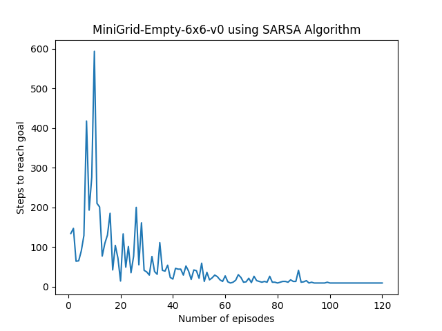
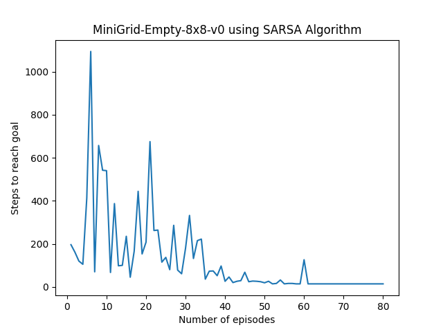

# Flappy_bird_RL

## ~Sub-projects for main project:
 - Frozen lake
 * Empty room environment using openai gym
    * Using MonteCarlo , Q learning, Sarsa , Sarsa-Lambda Algorithms 

## Requirements
To run this environment, you need to have the following libraries installed:
- NumPy
- Matplotlib
- Gym
  
# 1)Frozen lake: 

#### Created in [Frozen-Lake](https://github.com/RaviAgrawal-1824/Assignment-1-Frozen-Lake) environment.

**Description**: For better understanding of the **Policy** and **Value** Iteration using the Frozen lake environment for both Deterministic and Stochastic of fully observable environments.

### Non-Slippery Environment

 

**ALGORITHM**

Here Dynamic Programming method is used for convergence of policy.
This can also be done by two ways
### Policy Iteration
  - Evaluating Value function for all states
  - Acting greedy toward policy using action value function evaluated using value function
  - Iterated many times upto convergence of policy
### Value Iteration
  - Evaluating Value function for particular state
  - Taking Greedy of all action it can take from that state using Action value function
  - Then converging policy

**STATE SPACE**

* For 4x4 grid there are 16 cells and each cell represents a integer starting from 0 to 15.
* Any cell may contain a obstacle (Hole) or Frozen lake and the aim of the agent is to reach the Goal in optimal way using policy and value iteration.

**ACTION SPACE**

The action space consists of 4 actions -

	LEFT - 0
	DOWN - 1
	RIGHT- 2
	UP   - 3

 **REWARD FUNCTION**

* +1 if the agent reaches the goal cell.
* 0 otherwise.

# 2)Frozen lake with slippery environment

### Slippery Environment

This Frozen Lake environment is solved by Dynamic Programming Method using Reinforcement learning.

**Description**: For better understanding of the **Policy** and **Value** Iteration using the same Frozen lake environment with slippery conditions.

**ALGORITHM**
* Policy and Value iteration algorithms are used in this slippery Environment to get the optimal policy.

  

# 3)Empty Room Environment

#### Created in [MiniGrid-Empty-Environment](https://github.com/Farama-Foundation/MiniGrid) environment.

## Requirements
To run this environment, you need to have the following libraries installed:
- numpy
- matplotlib
- gymnasium
- minigrid

## Description
**Description**: To train agent to reach terminal state by using different algorithms in 6x6 and 8x8 minigrid environment.

 

**Installation**
Use this code for intalling some library
- pip install minigrid
- pip install numpy
- pip install matplotlib
- pip install gymnasium

**Action Space**
** The action space Used here - **

	Turn LEFT - 0
	Turn Right - 1
	Move Forward - 2

**State Space**
* There are 16 states in MiniGrid-Empty-6x6-v0 environment and each cell is represented by (x,y) where x = 1,2,3,4 and y = 1,2,3,4 and also the agent position can be accessed through the built-in function called "agent_pos".
* Similarily, there are 36 states in MiniGrid-Empty-8x8-v0 environmnet where each cell is represnted by (x,y) where x = 1 to 6 & y = 1 to 6.
* State space also requires the direction of the agent facing towards that can be accessed through user built-in functions from the minigrid files which is "agent_dir".
* Agent aim is to reach the final goal state in an optimized way by using the algorithms like Monte-carlo, SARSA, SARSA Lambda, Q-Learning.

### Rewards
Every state has 0 reward except at terminal state.

## ~Results Using SARSA Algorithm:

