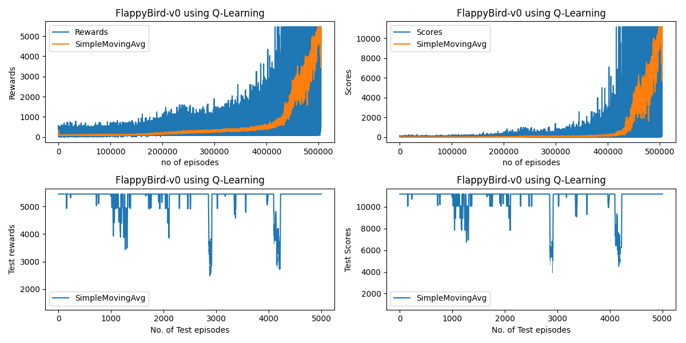

# Flappy_bird_RL

## ~Sub-projects for main project:
 - Frozen lake([Frozen-Lake](https://github.com/RaviAgrawal-1824/Assignment-1-Frozen-Lake))
 * Empty room environment using openai gym ([MiniGrid-Empty-Environment](https://github.com/Farama-Foundation/MiniGrid) )
    * Using MonteCarlo , Q learning, Sarsa , Sarsa-Lambda Algorithms 

## Requirements
To run this environment, you need to have the following libraries installed:
- NumPy
- Matplotlib
- Gym
  
# 1)Frozen lake: 

#### Created in [Frozen-Lake](https://github.com/RaviAgrawal-1824/Assignment-1-Frozen-Lake) environment.
**Aim** :  In FROZEN LAKE Environment, We have to make an agent who learns how to reach goal by crossing frozen lakes and Holes.

**Description** :  For better understanding of the **Policy** and **Value** Iteration using the Frozen lake environment for both Deterministic and Stochastic of fully observable environments.This environment also involve Non-Slippery (Deterministic) and Slippery (Stochastic) conditions.

This Frozen Lake environment is solved by Dynamic Programming Method using Reinforcement learning.

## Environment Description
   **STATE SPACE**

* For 4x4 grid there are 16 cells and each cell represents a integer starting from 0 to 15.
* Any cell may contain a obstacle (Hole) or Frozen lake and the aim of the agent is to reach the Goal in optimal way using policy and value iteration.

**ACTION SPACE**

The action space consists of 4 actions -

	LEFT - 0
	DOWN - 1
	RIGHT- 2
	UP   - 3

 **REWARD FUNCTION**

* +1 if the agent reaches the goal cell.
* 0 otherwise.

### Non-Slippery Environment

 

**ALGORITHM**

Here Dynamic Programming method is used for convergence of policy.
This can also be done by two ways
### Policy Iteration
  - Evaluating Value function for all states
  - Acting greedy toward policy using action value function evaluated using value function
  - Iterated many times upto convergence of policy
### Value Iteration
  - Evaluating Value function for particular state
  - Taking Greedy of all action it can take from that state using Action value function
  - Then converging policy

# 2)Frozen lake with slippery environment

### Slippery Environment

This Frozen Lake environment is solved by Dynamic Programming Method using Reinforcement learning.

**Description**: For better understanding of the **Policy** and **Value** Iteration using the same Frozen lake environment with slippery conditions.

Agent slips if he reaches a cell having ice ,then lands up in any cell next to current state(cell)  

**ALGORITHM**
* Policy and Value iteration algorithms are used in this slippery Environment to get the optimal policy.
  

# 3)Empty Room Environment

#### Created in [MiniGrid-Empty-Environment](https://github.com/Farama-Foundation/MiniGrid) .

**Aim:**

* The objective for the agent is to achieve the goal state in the most efficient manner possible.

**Description:**

* The Minigrid Environment is an empty room containing one agent and one goal state, with no obstacles.
* There are two environments available: MiniGrid-Empty-6x6-v0 and MiniGrid-Empty-8x8-v0.
* The environment is model-free.

 

## Requirements
To run this environment, you need to have the following libraries installed:
- NumPy
- Matplotlib
- gymnasium
- MiniGrid

**Installation**
Use this code for intalling some library
- pip install minigrid
- pip install numpy
- pip install matplotlib
- pip install gymnasium

This environment is an empty room, and the goal of the agent is to reach the green goal square, which provides a sparse reward.

## Environment Decription

**Action Space**
** The action space Used here - **

	Turn LEFT - 0
	Turn Right - 1
	Move Forward - 2

**State Space**
* There are 16 states in MiniGrid-Empty-6x6-v0 environment and each cell is represented by (x,y) where x = 1,2,3,4 and y = 1,2,3,4 and also the agent position can be accessed through the built-in function called "agent_pos".
* Similarily, there are 36 states in MiniGrid-Empty-8x8-v0 environmnet where each cell is represnted by (x,y) where x = 1 to 6 & y = 1 to 6.
* - State space also contain the direction of the agent at that state, the direction are as follows,
  	- 0 = Right 
  	- 1 = Down
  	- 2 = Left
  	- 3 = Up
- Obseravtion contain iamge array which can be used to identify where the agent is in environment.
* Agent aim is to reach the final goal state in an optimized way by using the algorithms like Monte-carlo, SARSA, SARSA Lambda, Q-Learning.

### Rewards
Every state has 0 reward except at terminal state.

### Termination

If agent reaches goal

If maximum no. of steps of agent are reached

## Algorithms
Four algorithm are used to converge the policy and take optimal actions,
- Monte-Carlo
- SARSA
- SARSA Lambda
- Q-Learning

## Results
#### MiniGrid-Empty-6x6-v0

# Flappy Bird Environment

#### Created in [Flappy-Bird](https://github.com/Talendar/flappy-bird-gym) Environment.

**Aim:**
* The agent bird learns to score by crossing pipes with the Q-Learning Algorithm.

**Description:**

FlappyBird is the main project. The main aim is to train agent (Bird) to move through maximum pipes without hitting any of the pipe. Any of the previous Algorithms can be used to train the agent.

Algorithm used here to train agent is Q-Learning.

  
### Requirements
To run this environment, you need to have the following libraries installed:
- NumPy
- flappy_bird_gym (Imported from Github clone)
- pygame
- Matplotlib (For plotting graphs)
- time 

## Environment Description

### State Space

- This environment contain state as location coordinate of bird's centre in environment.
- Observation from environment is horizontal distance and vertical distance from centre of next pipe to centre of bird
- States normalization status is False ie. we are getting states in form of integers
- Agent also has direction it is going after flap in observation space(Here we have fixed the angle of rotation & direction to 0°)

### Action Space

- There are two actions in this Environment
  - 0 = Do Nothing
  - 1 = Flap
- After taking Flap as action bird changes its direction by 45° (In this case we have fixed the direction to 0°)

### Reward

- Reward is +1 for every step agent (bird) takes.
- Reward is +5 for crossing each pipe.
- Reward is -10 if the bird Crashes.

### Termination

If bird hits pipe or collides with ground

If maximum no. of steps of bird are reached
## Algorithm

Flappy Bird Environment is solved by Q-Learning Algorithm.

Q-learning is a model-free reinforcement learning algorithm to learn the value of an action in a particular state.

It does not require a model of the environment (hence "model-free"), and it can handle problems with stochastic transitions and rewards without requiring adaptations.

For any finite Markov decision process, Q-learning finds an optimal policy

## Results

## Graphs

